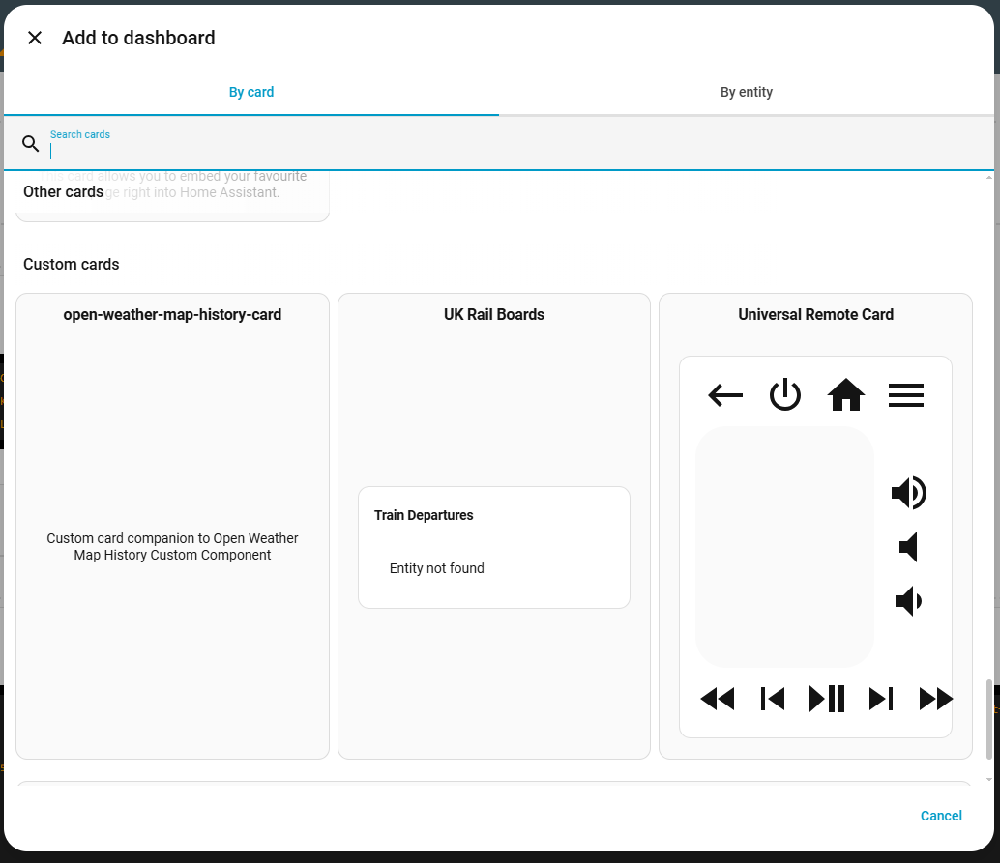
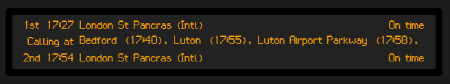
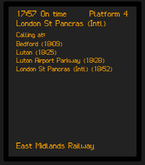
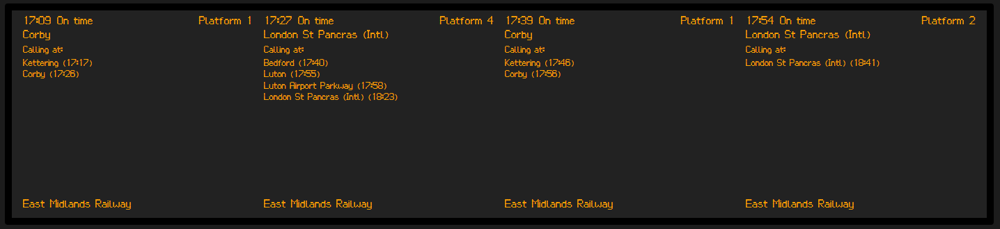
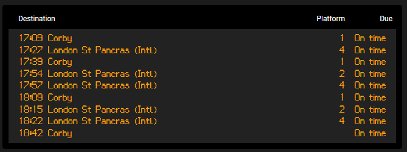

# National Rail UK Board (Demo + Lovelace Card)

This project is a Home Assistant card designed to be used alongside [https://github.com/darrenparkinson/homeassistant_nationalrail](https://github.com/darrenparkinson/homeassistant_nationalrail).  This renders the data from the national rail plugin similar to UK boards.

It contains multiple layout types (e.g. over-platform board, or a board showing a single train, or a table), and provides support for different themes.  The default theme uses the older LED-style layout.

## Getting started

Before using this card, make sure you have:

- A working Home Assistant installation: https://www.home-assistant.io/getting-started/
- HACS installed and configured: https://hacs.xyz/docs/installation/prerequisites

You must also set up the [homeassistant_nationalrail](https://github.com/darrenparkinson/homeassistant_nationalrail) integration first:

1. Install `homeassistant_nationalrail` from its GitHub repository.
2. Configure at least one station to retrieve departure data.
3. Use the station CRS code for that station; CRS codes can be looked up here:
   https://www.nationalrail.co.uk/stations_destinations/48541.aspx

The integration requires an API key from raildata.org.uk:

- Sign in or create an account at https://raildata.org.uk/
- Locate the "[Live Departure Board](https://raildata.org.uk/dashboard/dataProduct/P-d81d6eaf-8060-4467-a339-1c833e50cbbe/overview)" data and subscribe to it
 - Go back to this data set and select the "Specification" tab a little down on the page to find your API key for this data
- Add that API key to your `homeassistant_nationalrail` configuration

**Important: the current `homeassistant_nationalrail` version `1.0.2` does not yet include information about train stops. That feature is pending in PR https://github.com/darrenparkinson/homeassistant_nationalrail/pull/2, so calling-at details will be missing until the update is merged.  In the interim you can use [my fork](https://github.com/CraigHawker/homeassistant_nationalrail) and install manually.**

Once the integration is working and at least one station is returning data, install this card in HACS as a custom repository:

1. In Home Assistant, open HACS > Frontend.
2. Add a custom repository using this repository's GitHub URL.
3. Set the repository type to `Frontend`.
4. Install `UK Rail Boards`.

After installation, refresh Home Assistant or restart if needed. Then add the card to a dashboard.  The card should be shown in the list of custom cards:


If you wish to install it manually you can download the output from the 'Releases' section shown on the right of this projec's github page.

Developers looking to extend this project can fork the repository, download the code, then use the build task to generate the various things that are needed.  The "demo/index.htm" page can be used to render some snapshot data with various themes and layouts.

## Configuration options

When you add or edit a card using the graphical editor, you can configure exactly how it works:


### Entity

Choose the entity that shows your station.  This is configured in the other - `homeassistant_nationalrail` plugin above.  This is mandatory.

### Title

Optional card title.

### Layout

The card supports four layouts:

- Overhead platform board
- Single train departure board
- Table board
- Responsive (dynamic) board

#### Overhead platform board

This board mimics the typical "overhead platform" board you see at many stations.  The top row shows the next train time, destination, and status.  The next row shows the stations (and times) it calls at.  The final row shows the upcoming trains, rotating from the third train to the ninth.



#### Single train departure board

This board mimics a table showing a single train at a time.  Note that if there is sufficient space, the board will show multiple trains side-by-side:





#### Table board

This board mimics a table showing all upcoming trains.



#### Responsive (dynamic)

The responsive layout will attempt to choose the best layout considering the available space in your dashboard.  At small widths the card will be shown using the single-train layout, slightly wider as a table, then as the overhead platform board, then - at very large widths - as a series of single train boards next to each other.

### Themes

#### Default

The default theme shows using an older-style "Orange LED" style.  This is, for many, the iconic classic board layout.  The font is [UkPIDS](https://github.com/ProbablyIdiot/UkPIDS-Font?tab=readme-ov-file), used under the SIL open font licence.

#### Modern

This is a work-in-progress, aimed to align more with the newer LCD-style boards, using bolder colours, a more modern font, and a more aesthetic visual.  Some layouts do not yet support this theme.

### Advanced options

#### Maximum rows

The maximum number of rows to show.  Note that the `homeassistant_nationalrail` integration may return more rows than this card can deal with.  Defaults to 9.

#### Platform filter

If you only care about a subset of platforms then you can use this to filter.  For example, for my local station the trains going south are always on platforms 2 and 4 and the trains going north on platforms 1 and 3.  You can either enter a string here (which must match the platform exactly, such as "1A", or "2") or a comma-separated list of platforms (e.g. "1, 2, 3").

#### Hide delayed

If true, hides delayed trains on the board.

#### Hide cancelled

If true, hides cancelled trains on the board.

#### Hide platform

If true, hides the platform on the board.

#### Hide operator

If true, hides the opertor (e.g. "Great Western Railways") on the board.

#### Refresh interval

The amount of time before the board is refreshed.

## Installation

Please see the getting-started section above for more information.

## HACS Setup

This card is not yet published to the official HACS store, so you must add it as a custom repository.

1. In HACS, go to Frontend.
2. Open the three-dot menu and choose `Custom repositories`.
3. Add this repository's GitHub URL.
4. Set repository type to `Frontend`.
5. Install `UK Rail Boards`.
6. If HACS does not register the resource automatically, add `/hacsfiles/ukrailboards-card.js` as a Lovelace resource.


## A note about non-simple-screen-scenarios

This card uses CSS keyframe animations to fade items in and out, to scroll them left/right (if they overflow the available space), etc.  Whilst the card supports situations where the browser states that it wants minimal animation, I am interested in exactly how well this works.  If you are trying this on a low-refresh-rate screen (e.g. e-ink) then let me know!

## For maintainers

* There are a number of VSCode tasks:
 * 'Copy handlebars' - handlebars is used as a templating language to make maintaining the HTML easier.  This task copies handlebars into the appropriate location from the npm package
 * 'Build SCSS' - builds the SASS files into the ditributable CSS files.  One-time operation.
 * 'Watch SCSS' - same as the above, but watches the files for changes and rebuilds as needed.  Useful during development.
 * 'Build lovelace' - precompiles the handlebars templates and pulls together both the demo JS and the actual lovelace card.
* There are two github actions:
 * 'validate' - run on push and validates everything according to HCAS' rules
 * 'release' - generates a CalVer (calendar-versioning, i.e. "2026.03.1") build number, then creates and publishes a release.  This is a manual step run by an administrator.  More details within the "release flow" section below.
 * The `src` folder contains the actual source of the application (see more details below).
 * The `build-lovelace.mjs` file contains a build script used to create the `dist` folder contents.
 * The `has.json` file used to describe this application to HCAS.

### The src folder

The src folder contains the application source code; all the templates, fonts, scripts, stylesheets, etc. needed to build the application:

* `\src\demo` folder contains the source files used for the demo site.  When the build task is run it generates the \demo folder which can be used to show the various layouts and themes.
* `\src\fonts` contains the fonts used by the application.
* `\src\images` contains images used within the readme.
* `\src\lovelace` contains the raw lovelace card.
* `\src\scripts` contain JavaScript files used within both the demos and the package itself.
* `\src\shared` contains helpers for registering the handlebars helpers.
* `\src\styles` contains the SASS files used for various layouts and themes.
* `\src\templates` contains the handlebars templates.

### Maintainer Release Flow

The repository includes a GitHub Actions workflow that creates a GitHub release when an administrator runs it manually from the GitHub Actions UI.

Release tags use CalVer in the format `vYYYY.MM.DD`.

By default, running the release workflow on the default branch creates a stable release.

Stable releases on the default branch are restricted to users with GitHub admin permission on this repository. Non-admin users can still create prereleases by providing a `suffix`.

Prerelease behavior:

- If you provide a `suffix` input (for example `beta`), the workflow creates a prerelease and appends the suffix to the tag (for example `v2026.03.27-beta`).
- If you run on a non-default branch and do not provide `suffix`, the workflow uses a sanitized branch name as the suffix (for example `v2026.03.27-configuration-testing`) and creates a prerelease.

If more than one release is created with the same base tag on the same London calendar day, the workflow automatically appends a numeric suffix such as `v2026.03.27.1` or `v2026.03.27-beta.1`.

Examples:

```bash
v2026.03.27
v2026.03.27.1
v2026.03.27-beta
v2026.03.27-beta.1
v2026.03.27-configuration-testing
```

That workflow rebuilds the package root in `dist/` and uploads every file from that folder so the release contains `hacs.json`, `ukrailboards-card.js`, and the font files together. The demo bundle remains in `demo/` for the example page and is not part of the HACS release package.

Each manual run calculates the next available CalVer tag using the same rules, so you do not need to track daily build numbers yourself.

To inspect the local release package without GitHub Actions, run `npm run package:inspect`.  That stages the exact `dist/` package layout under `artifacts/release-inspect/package-root/`.
